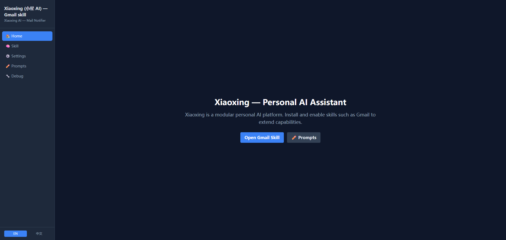

# Xiaoxing AI (小星 AI)

> Automatically fetch unread Gmail → AI analysis & summary → Telegram notification


[中文文档](README.zh.md)

---

## Features

- 📥 **Gmail Fetch** — Polls primary inbox for unread emails via Google OAuth2
- 🤖 **AI Analysis** — Local llama.cpp or OpenAI model classifies, prioritizes, and summarizes each email
- 📱 **Telegram Push** — AI-written HTML notifications sent to a specified chat; message style and language fully customizable via prompt
- 💬 **Telegram Bot Chat** — Built-in "Xiaoxing" (小星 AI) persona bot replies to Telegram messages in real time using chat history
- 👤 **User Profile** — AI automatically builds a user profile from chat history; updated every midnight and fed back into chats
- 🗃️ **Email Records** — Every processed email (raw body, AI analysis, summary, Telegram message, token count) is persisted in SQLite for later querying
- 🔄 **Deduplication** — Processed email IDs persisted in SQLite; no duplicate notifications after restart
- ⚙️ **Priority Filter** — Configurable to only notify high/medium priority emails
- 🗄️ **SQLite Database** — All state (sent IDs, OAuth token, worker logs, email records, user profiles) stored in `gmailmanager.db`
- 📋 **Typed Logs with Token Tracking** — Worker logs are categorised (`email` / `chat`), token usage recorded per entry, displayed with colour-coded badges on the dashboard
- 🔌 **Connection Tests** — One-click AI / Database / Telegram / Gmail OAuth health-check on the Settings page
- 🖥️ **React Web UI** — 4-page dark-themed SPA (React + TypeScript + Vite + Tailwind CSS): Dashboard, Settings, Prompt Editor, Debug Tools
- ✏️ **Prompt Editor** — Edit, create, and assign prompt files per processing stage directly from the UI
- 🔧 **Hot Reload Config** — All settings update live via the web UI without restarting the server
- 🌐 **i18n** — English / Chinese UI, language preference persisted via Zustand

---

## Screenshots

### Dashboard


---

## Requirements

- Python 3.11+
- Node.js 18+ (for the React frontend)
- Telegram Bot Token + Chat ID
- Google Cloud OAuth2 credentials (`credentials.json`)
- **LLM backend** — either:
  - Local: llama.cpp `llama-server` (listening on `127.0.0.2:8001`)
  - Cloud: OpenAI API key

---

## Quick Start

### 1. Clone

```bash
git clone <repository-url>
cd gmailManager
```

### 2. Install Python Dependencies

```bash
python -m venv .venv
.venv\Scripts\activate        # Windows
# source .venv/bin/activate   # macOS/Linux
pip install -r requirements.txt
```

### 3. Install Frontend Dependencies

```bash
cd frontend
npm install
cd ..
```

### 4. Configure Environment

```bash
copy .env.example .env        # Windows
# cp .env.example .env        # macOS/Linux
```

Edit `.env` and fill in the values (see [How to Get Tokens](#how-to-get-tokens) below):

| Variable | Description |
|----------|-------------|
| `TELEGRAM_BOT_TOKEN` | Telegram Bot token from @BotFather |
| `TELEGRAM_CHAT_ID` | Target chat ID for notifications |
| `GMAIL_POLL_INTERVAL` | Poll interval in seconds (default: 300) |
| `GMAIL_POLL_QUERY` | Gmail search query (default: primary inbox unread) |
| `GMAIL_POLL_MAX` | Max emails to process per poll (default: 20) |
| `GMAIL_MARK_READ` | Mark as read after processing (true/false) |
| `NOTIFY_MIN_PRIORITY` | Comma-separated priorities to notify; leave empty for all |
| `LLM_BACKEND` | `local` or `openai` (default: `local`) |
| `LLM_API_URL` | LLM endpoint URL |
| `LLM_MODEL` | Model name |
| `OPENAI_API_KEY` | OpenAI API key (required when `LLM_BACKEND=openai`) |
| `PROMPT_ANALYZE` | Prompt file for email analysis (default: `email_analysis.txt`) |
| `PROMPT_SUMMARY` | Prompt file for email summary (default: `email_summary.txt`) |
| `PROMPT_TELEGRAM` | Prompt file for Telegram message writing (default: `telegram_notify.txt`) |
| `PROMPT_CHAT` | Prompt file for Telegram Bot chat replies (default: `chat.txt`) |
| `PROMPT_PROFILE` | Prompt file for user profile generation (default: `user_profile.txt`) |

### 5. Place Google Credentials

Download `credentials.json` from Google Cloud Console and place it in the project root.

### 6. Start the Backend

```bash
uvicorn app.main:app --host 127.0.0.1 --port 8000 --reload
```

Or via the BAT script (Windows):
```bash
启动.bat
```

### 7. Start the Frontend

**Development mode** (hot reload):
```bash
cd frontend
npm run dev
```
Open: `http://localhost:5173`

**Production mode** (build once, served by backend):
```bash
cd frontend
npm run build
```
Then open: `http://127.0.0.1:8000`

### 8. Authorize Gmail

Click **🔑 Authorize via Google** on the Dashboard, or open:
```
http://127.0.0.1:8000/gmail/auth
```

Complete the Google OAuth flow. `token.json` will be generated automatically.

---

## How to Get Tokens

### Telegram Bot Token

1. Search **@BotFather** on Telegram
2. Send `/newbot`
3. Enter a display name and a username ending in `bot`
4. BotFather replies with the token — this is your `TELEGRAM_BOT_TOKEN`

```
Example: 1234567890:ABCdefGhIJKlmNoPQRstuVWXyz
```

### Telegram Chat ID

**Method 1 (easiest):** Search **@userinfobot** on Telegram and send any message — it replies with your Chat ID.

**Method 2:** Send any message to your Bot, then open:
```
https://api.telegram.org/bot<YOUR_TOKEN>/getUpdates
```
Find `message.chat.id` in the returned JSON. The Settings page also has a **🔍 Get Chat ID** button that polls automatically.

### Google OAuth2 credentials.json

1. Go to [Google Cloud Console](https://console.cloud.google.com/)
2. Create or select a project
3. Enable **Gmail API**: APIs & Services → Library → search `Gmail API` → Enable
4. Create credentials: APIs & Services → Credentials → Create Credentials → OAuth client ID
   - Application type: **Desktop app**
5. Download the JSON file, rename it to `credentials.json`, place in project root
6. Click **Authorize via Google** on the Dashboard to complete authorization

> ⚠️ `credentials.json` and `token.json` contain sensitive data and are excluded from git via `.gitignore`. Never commit them.

---

## Project Structure

```
gmailManager/
├── app/
│   ├── main.py                 # FastAPI entry point, all API routes
│   ├── config.py               # Environment variable loader (hot-reloadable)
│   ├── db.py                   # SQLite layer — thread-local connections, WAL mode
│   ├── mail/
│   │   ├── auth.py             # Google OAuth2 flow (token stored in DB)
│   │   └── client.py           # Gmail fetch / parse / mark-as-read
│   ├── service/
│   │   ├── ai_service.py       # LLM calls: email analysis, summary, Telegram message, bot chat, user profile
│   │   ├── telegram_sender.py  # Telegram message sender
│   │   ├── worker.py           # Background poll worker (step logs, email record persistence)
│   │   └── tg_bot_worker.py    # Telegram Bot long-poll worker (chat, profile generation)
│   ├── utils/
│   │   ├── json_parser.py      # Extract JSON from LLM output
│   │   ├── prompt_loader.py    # Load prompt files from app/prompts/
│   │   └── telegram.py         # HTML sanitiser for Telegram messages
│   ├── prompts/
│   │   ├── email_analysis.txt  # Analysis prompt
│   │   ├── email_summary.txt   # Summary prompt
│   │   └── telegram_notify.txt # Telegram format prompt
│   └── schemas/
│       └── email.py            # Pydantic request models
├── frontend/                   # React + TypeScript + Vite SPA
│   ├── src/
│   │   ├── api/                # Axios API client + typed interfaces
│   │   ├── components/         # Shared components (Layout, Sidebar)
│   │   ├── i18n/               # EN/ZH translations, Zustand language store
│   │   ├── pages/
│   │   │   ├── Home.tsx        # Dashboard: worker controls, bot chat, step log
│   │   │   ├── Settings.tsx    # Config editor + connection tests
│   │   │   ├── Prompts.tsx     # Prompt file editor & stage assignment
│   │   │   └── Debug.tsx       # Manual AI/Gmail debug tools
│   │   ├── App.tsx
│   │   └── main.tsx
│   ├── vite.config.ts          # Proxy /api/* → FastAPI :8000
│   └── package.json
├── credentials.json            # Google OAuth2 credentials (not in git)
├── .env                        # Runtime config (not in git)
├── .env.example
├── requirements.txt
├── 启动.bat                     # Windows: start uvicorn
├── README.md
└── README.zh.md
```

---

## Prompts (customization)

Prompt files live in `app/prompts/*.txt`. The project ships three built-in prompts:

- `email_analysis.txt` — classifies, prioritizes, and extracts action from the raw email
- `email_summary.txt` — receives the analysis result as input, produces structured JSON (category, key points, time/location/person, etc.)
- `telegram_notify.txt` — defines a fixed HTML template with placeholders; AI fills in subject, sender, summary, key points, etc.

Use the **Prompt Editor** page in the UI to edit/create/assign prompt files without restarting. Changes take effect immediately.

---

## API Endpoints

| Method | Path | Description |
|--------|------|-------------|
| GET | `/health` | Health check |
| GET | `/ai/ping` | Test AI/LLM connectivity |
| POST | `/ai/analyze` | Analyze a single email |
| POST | `/ai/summary` | Summarize a single email |
| POST | `/ai/process` | Full pipeline: analyze → summarize → Telegram message |
| GET | `/gmail/auth` | Redirect to Google OAuth page |
| GET | `/gmail/callback` | OAuth callback, save token |
| POST | `/gmail/fetch` | Manually fetch emails |
| POST | `/gmail/process` | Fetch, process, and persist emails to DB |
| POST | `/worker/start` | Start background poll worker |
| POST | `/worker/stop` | Stop worker |
| GET | `/worker/status` | Worker status |
| POST | `/worker/poll` | Trigger an immediate poll |
| GET | `/worker/logs` | Recent step logs (`?limit&log_type=email\|chat`) |
| DELETE | `/worker/logs` | Clear worker step logs |
| GET | `/email/records` | List persisted email records (`?limit&priority`) |
| GET | `/email/records/{email_id}` | Get a single email record |
| POST | `/telegram/test` | Send a Telegram test message |
| GET | `/telegram/chat_id` | Retrieve latest chat ID via getUpdates |
| POST | `/telegram/bot/start` | Start Telegram Bot chat worker |
| POST | `/telegram/bot/stop` | Stop Telegram Bot chat worker |
| GET | `/telegram/bot/status` | Bot worker running status |
| POST | `/telegram/bot/clear_history` | Clear all in-memory chat history |
| GET | `/telegram/bot/profile` | Get AI-generated user profile |
| DELETE | `/telegram/bot/profile` | Delete user profile |
| GET | `/prompts` | List all prompt files |
| GET | `/prompts/{filename}` | Read a prompt file |
| POST | `/prompts/{filename}` | Create or overwrite a prompt file |
| DELETE | `/prompts/{filename}` | Delete a custom prompt file (built-ins protected) |
| GET | `/config` | Read current runtime config |
| POST | `/config` | Update `.env` and hot-reload config |
| GET | `/db/stats` | SQLite database statistics |

Interactive docs: `http://127.0.0.1:8000/docs`

---

## Realtime status & frontend cache keys

- Backend exposes two separate, frontend-friendly status endpoints:
   - `GET /gmail/workstatus` — returns the Gmail worker status (same shape as `/worker/status`).
   - `GET /chat/workstatus` — returns the Chat (Telegram bot) running status as `{ "running": boolean }`.

- WebSocket push endpoints (proxied by the frontend under `/api`):
   - `/api/ws/worker/status` — pushes Gmail worker status updates.
   - `/api/ws/bot/status` — pushes Chat (bot) status updates.

- Frontend helper functions (see `frontend/src/api/index.ts`):
   - `getGmailWorkStatus()` → calls `/gmail/workstatus`
   - `getChatWorkStatus()` → calls `/chat/workstatus`

- React Query cache keys used by the frontend:
   - `['gmailworkstatus']` — cached Gmail worker status
   - `['chatworkstatus']` — cached Chat (bot) status

- Notes: status updates are centralized on the Home page; the frontend no longer relies on a legacy `getBotStatus()` helper.


---

## LLM Configuration

| | Local llama-server | OpenAI API |
|---|---|---|
| `LLM_BACKEND` | `local` | `openai` |
| `LLM_API_URL` | `http://127.0.0.2:8001/v1/chat/completions` | `https://api.openai.com/v1/chat/completions` |
| `LLM_MODEL` | `local-model` | `gpt-4o-mini`, `gpt-4o`, etc. |
| `OPENAI_API_KEY` | *(not needed)* | `sk-...` |
| Requires GPU | Yes | No |
| Cost | Free | Per-token billing |

### Option A — Local llama-server (default)

1. Install [llama.cpp](https://github.com/ggerganov/llama.cpp) and download a GGUF model  
   (recommended: `Qwen2.5-14B-Instruct-Q4_K_M.gguf`)
2. Start llama-server on `127.0.0.2:8001`

```ini
LLM_BACKEND=local
LLM_API_URL=http://127.0.0.2:8001/v1/chat/completions
LLM_MODEL=local-model
```

### Option B — OpenAI API

```ini
LLM_BACKEND=openai
LLM_API_URL=https://api.openai.com/v1/chat/completions
LLM_MODEL=gpt-4o-mini
OPENAI_API_KEY=sk-...
```

> Any OpenAI-compatible API (e.g. Azure OpenAI, Ollama with openai shim) works by adjusting `LLM_API_URL` and `OPENAI_API_KEY`.

---

## Notes

- `credentials.json` contains sensitive OAuth client secrets — keep it out of version control (already in `.gitignore`).
- OAuth tokens, processed email IDs, email records, and user profiles are stored in **`gmailmanager.db`** (SQLite, also in `.gitignore`). Delete the database to reset all state.
- Each email triggers **3 LLM calls**: analysis → structured summary → template-based Telegram message. All three prompts are independently configurable from the UI.
- LLM calls retry up to 3 times with exponential backoff on transient errors. Email bodies longer than 4000 characters are automatically truncated.
- The SQLite layer uses **thread-local connections** with WAL mode — safe for concurrent access from FastAPI threadpool, email worker, and bot worker threads.
- Worker logs include ISO timestamps (`YYYY-MM-DDTHH:MM:SS`), are typed (`email` / `chat`), and include per-entry token counts displayed as colour-coded badges on the dashboard.
- The Telegram Bot chat worker runs independently from the email worker. The bot maintains per-chat conversation history and generates an AI user profile each midnight.
- Telegram messages are sent in **HTML format**. LLM output is automatically sanitised: Markdown bold (`**text**`) is converted to `<b>`, unsupported tags are normalised, and unknown tags (e.g. `<user@domain>`) are safely escaped.

---

## License

MIT
